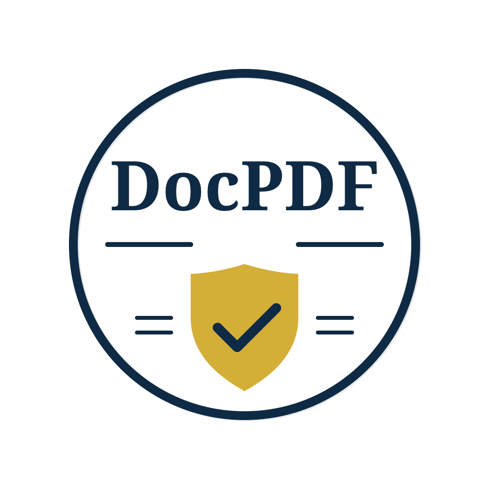

<table><tr><td valign="top" width="200">
  <picture>
    <source media="(prefers-color-scheme: dark)" srcset=".github/logo-dark.svg">
    
  </picture>
</td><td>
  <h1>DocPDF</h1>
  <p>Convert documents from any common format to PDF, with optional watermarking. Zero hard dependencies; bring your own PDF library.</p>
  <p>
    <a href="https://github.com/velocity-labs/docpdf/actions/workflows/ci.yml"></a>
    <a href="https://rubygems.org/gems/docpdf"></a>
  </p>
</td></tr></table>

## Supported Formats

| Input Format | Conversion Tool | Ruby Gem Required |
|-------------|----------------|-------------------|
| PDF | Passthrough | None |
| Word (.doc, .docx) | LibreOffice | None (system dep) |
| Excel (.xls, .xlsx) | LibreOffice | None (system dep) |
| PowerPoint (.ppt, .pptx) | LibreOffice | None (system dep) |
| OpenDocument (.odt, .ods, .odp) | LibreOffice | None (system dep) |
| CSV, HTML, RTF | LibreOffice | None (system dep) |
| Plain text | Prawn or HexaPDF | `prawn` or `hexapdf` |
| JPEG, PNG | RMagick or MiniMagick | `rmagick` or `mini_magick` |
| HEIC, WebP | RMagick or MiniMagick | `rmagick` or `mini_magick` |

> **Note:** PDF and Word/RTF conversion work with zero gem dependencies. You only need adapter gems for text, image, and watermarking features. If you try to use a feature without the required gem, you'll get a clear error telling you which gem to add.

## Installation

```ruby
gem "docpdf"
```

Then pick the adapters you need:

```ruby
# Minimum for text + watermarking (one gem covers both):
gem "hexapdf"

# Or use two separate gems:
gem "prawn"       # text-to-PDF conversion + watermark stamp generation
gem "combine_pdf" # PDF watermark stamping

# For image conversion (pick one):
gem "rmagick"     # full ImageMagick bindings (handles HEIC, WebP, JPEG, PNG)
gem "mini_magick" # lighter shell wrapper (same format support)
```

**System dependencies:**

- **Ruby >= 3.3**
- **LibreOffice** for Word/RTF conversion. `soffice` must be on PATH.
- **ImageMagick** + **Ghostscript** required by RMagick/MiniMagick for image conversion.

## Usage

### Convert files

```ruby
# From a file path (format is detected automatically)
result = DocPDF.convert("document.docx")     # Word -> PDF via LibreOffice
result = DocPDF.convert("spreadsheet.xlsx")  # Excel -> PDF via LibreOffice
result = DocPDF.convert("slides.pptx")       # PowerPoint -> PDF via LibreOffice
result = DocPDF.convert("document.odt")      # OpenDocument -> PDF via LibreOffice
result = DocPDF.convert("data.csv")          # CSV -> PDF via LibreOffice
result = DocPDF.convert("page.html")         # HTML -> PDF via LibreOffice
result = DocPDF.convert("notes.txt")         # Text -> PDF via Prawn/HexaPDF
result = DocPDF.convert("scan.heic")         # Image -> PDF via RMagick/MiniMagick
result = DocPDF.convert("existing.pdf")      # PDF passthrough

# From an IO object (Rails UploadedFile, Tempfile, StringIO, etc.)
result = DocPDF.convert(params[:file])

# From raw binary data
result = DocPDF.convert(data: file_contents, mime_type: "image/png", filename: "photo.png")
```

The result is a `DocPDF::Result` with `data` (binary string) and `filename` (suggested output name).

### Watermark PDFs

Pass one or more stamp hashes. Each stamp uses either `image:` or `text:`.

```ruby
# Image watermark
result = DocPDF.watermark("report.pdf",
  { image: "logo.png", opacity: 0.06, position: :center })

# Text watermark (e.g., "DRAFT" diagonally across the page)
result = DocPDF.watermark("report.pdf",
  { text: "DRAFT", opacity: 0.1, position: :center, rotation: 45 })

# Mix image and text stamps with page targeting
result = DocPDF.watermark("report.pdf",
  { text: "CONFIDENTIAL", opacity: 0.1, position: :center, font_size: 60, rotation: 45 },
  { image: "logo.png", opacity: 0.3, position: :top_right, width: 80, pages: :first })

# Chain onto a conversion
result = DocPDF.convert("document.docx")
  .watermark({ text: "DRAFT", opacity: 0.1 })
```

Both `convert` and `watermark` return a `DocPDF::Result`, so you can chain them. `watermark` accepts file paths, IO objects, raw bytes, or a `Result` from a prior call.

Text watermarks auto-scale to fit the page when the font size would cause overflow.

#### Image stamp options

| Option | Default | Description |
|--------|---------|-------------|
| `image` | | Path to the image file |
| `opacity` | `0.1` | Transparency (0.0 = invisible, 1.0 = opaque) |
| `position` | `:center` | Anchor point on the page (see below) |
| `width` | `250` | Image width in points |
| `height` | proportional | Image height in points (scales proportionally if omitted) |
| `offset_x` | `0` | Horizontal nudge from anchor (positive = right, negative = left) |
| `offset_y` | `0` | Vertical nudge from anchor (positive = up, negative = down) |
| `pages` | `:all` | Which pages to stamp (see below) |

#### Text stamp options

| Option | Default | Description |
|--------|---------|-------------|
| `text` | | The text to render |
| `opacity` | `0.1` | Transparency (0.0 = invisible, 1.0 = opaque) |
| `position` | `:center` | Anchor point on the page (see below) |
| `font` | `"Helvetica"` | Font name (configurable via `watermark_options`) |
| `font_size` | `72` | Font size in points (configurable via `watermark_options`) |
| `color` | `"AAAAAA"` | Hex color string (configurable via `watermark_options`) |
| `rotation` | `45` | Degrees counter-clockwise (configurable via `watermark_options`) |
| `offset_x` | `0` | Horizontal nudge from anchor |
| `offset_y` | `0` | Vertical nudge from anchor |
| `pages` | `:all` | Which pages to stamp (see below) |

#### Positions

Stamps are centered on the anchor point, not placed by their corner.

| Position | Anchor |
|----------|--------|
| `:center` | Center of page |
| `:top` | Top center |
| `:bottom` | Bottom center |
| `:left` | Left center |
| `:right` | Right center |
| `:top_left` | Top-left corner |
| `:top_right` | Top-right corner |
| `:bottom_left` | Bottom-left corner |
| `:bottom_right` | Bottom-right corner |

#### Page targeting

| Value | Pages stamped |
|-------|---------------|
| `:all` | Every page (default) |
| `:first` | First page only |
| `:last` | Last page only |
| `:odd` | Odd pages (1, 3, 5...) |
| `:even` | Even pages (2, 4, 6...) |
| `3` | Specific page (1-indexed) |
| `[1, 3, 5]` | Array of page numbers |
| `2..5` | Range of page numbers |

### Rails integration

DocPDF works with file upload and attachment libraries out of the box:

```ruby
# ActionDispatch::Http::UploadedFile
result = DocPDF.convert(params[:document])

# Dragonfly
result = DocPDF.convert(record.document, filename: "output.pdf")

# Active Storage
result = DocPDF.convert(user.document)

# CarrierWave / Shrine
result = DocPDF.convert(record.file)
```

MIME type and filename are auto-extracted from each library's metadata. Use `filename:` to set the output name without affecting format detection.

## Configuration

All configuration is optional. DocPDF works out of the box with sensible defaults.

```ruby
DocPDF.configure do |config|
  # LibreOffice binary path (default: "soffice", found via PATH)
  config.soffice_path = "/usr/bin/soffice"

  # Stamper adapter for watermarking (default: nil, auto-detects hexapdf then combine_pdf)
  config.stamper = :hexapdf  # or :combine_pdf

  # Page size (default: "LETTER")
  config.page_size = "A4"

  # Plain text file conversion defaults
  config.text_options = {
    font: "Helvetica",          # default: "Courier"
    font_size: 12,              # default: 10
    margins: [72, 72, 72, 72],  # default: [50, 50, 50, 50] (points: top, right, bottom, left)
    color: "000000",            # default: "333333" (hex)
  }

  # Text watermark defaults (per-stamp options override these)
  config.watermark_options = {
    font: "Times",       # default: "Helvetica"
    font_size: 96,       # default: 72
    color: "FF0000",     # default: "AAAAAA" (hex)
    rotation: 30,        # default: 45 (degrees counter-clockwise)
  }
end
```

Converter adapters (for format-to-PDF conversion) are auto-detected based on MIME type and gem availability. The first available adapter wins, in registration order:

- **text/plain**: Prawn, then HexaPDF
- **image/\***: RMagick, then MiniMagick
- **Office formats**: LibreOffice (always available if installed)
- **application/pdf**: Passthrough (returned unchanged)
- **Unknown formats**: Fallback (tries LibreOffice, then returns raw data)

## Adapters

DocPDF has two types of adapters:

**Converter adapters** convert input data to PDF:

| Adapter | Gem | Formats |
|---------|-----|---------|
| Soffice | None (system) | Word, Excel, PowerPoint, ODF, CSV, HTML, RTF |
| Prawn | `prawn` | Plain text |
| HexaPDF | `hexapdf` | Plain text |
| RMagick | `rmagick` | JPEG, PNG, HEIC, WebP |
| MiniMagick | `mini_magick` | JPEG, PNG, HEIC, WebP |
| Passthrough | None | PDF (returned unchanged) |
| Fallback | None | Unknown formats (tries LibreOffice, then raw data) |

**Stamper adapters** apply watermarks to PDFs:

| Adapter | Gem(s) | Notes |
|---------|--------|-------|
| HexaPDF | `hexapdf` | All-in-one, handles both stamp generation and overlay |
| CombinePDF | `combine_pdf` + `prawn` | Prawn generates the stamp page, CombinePDF overlays it |

### Custom adapters

Register your own converter or stamper:

```ruby
# Custom converter for a specific MIME type
DocPDF::ConverterResolver.register(:my_converter,
  require_name: "my_gem",
  mime_types: %w[application/x-custom],
  loader: -> { require "docpdf/adapters/converters/my_converter"; MyConverter })

# Custom stamper
DocPDF::StamperResolver.register(:my_stamper,
  loader: -> { require "my_stamper"; MyStamper })
```

## Error Handling

All errors inherit from `DocPDF::Error`, so you can catch everything with one rescue or handle specific cases:

```ruby
begin
  result = DocPDF.convert("file.docx")
rescue DocPDF::Error => e
  # Catch any docpdf error
end
```

Specific error classes:

| Error | When |
|-------|------|
| `DocPDF::ConversionError` | Conversion failed (message includes adapter name and details) |
| `DocPDF::SofficeNotFoundError` | LibreOffice not installed or not on PATH |
| `DocPDF::AdapterNotFoundError` | Required gem not installed (message tells you which to add) |

## Deployment Notes

### ImageMagick policy.xml

Most Linux distributions ship ImageMagick with PDF conversion disabled for security. If image-to-PDF conversion fails with a permission error, find your ImageMagick `policy.xml` file (commonly at `/etc/ImageMagick-6/policy.xml` or `/etc/ImageMagick-7/policy.xml`) and change the PDF coder policy from `rights="none"` to `rights="read|write"`.

### LibreOffice on Heroku

Use the [LibreOffice buildpack](https://github.com/heroku/heroku-buildpack-apt) or AppImage approach.

### LibreOffice on Docker

```dockerfile
RUN apt-get update && apt-get install -y libreoffice-writer
```

## Contributing

Bug reports and pull requests are welcome on [GitHub](https://github.com/velocity-labs/docpdf).

1. Fork the repo
2. Create your feature branch (`git checkout -b my-feature`)
3. Make your changes with tests
4. Ensure all tests pass (`bundle exec rake test`)
5. Commit and push
6. Open a pull request

## Testing

```bash
# Install dependencies
bundle install

# Run the full test suite
bundle exec rake test

# Run tests for a specific adapter configuration
bundle exec appraisal hexapdf-only rake test
bundle exec appraisal no-adapters rake test

# Run all appraisals
bundle exec appraisal rake test
```

Available appraisals: `all`, `hexapdf-only`, `prawn-combine-pdf`, `rmagick`, `mini-magick`, `no-adapters`.

Tests require LibreOffice and ImageMagick installed locally.

## License

Copyright (c) 2026 Velocity Labs, LLC. Released under the [MIT License](LICENSE.txt).
